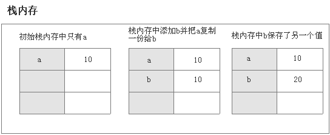

#变量

```javascript
var a = 1;
var b = a;
b = 2;
// 这时a是？

var a = 1;
var b = a;
a = 2;
// 这时b是？
```
```javascript
var m = { a: 1, b: 2 }
var n = m;
n.a = 2;
// 这时m是？

var m = { a: 1, b: 2 }
var n = m;
m.a = 2;
// 这时n是？

```

###数据类型
ECMAScript包括两个不同类型的值：基本数据类型和引用数据类型    
Number、String、Boolean、Undefined、Null，和ES6新增Symbol， 基本数据类型是按值访问的，因为可以直接操作保存在变量中的实际值。  
Object 、Array 、Function 、Data为引用数据类型，它不可以直接访问堆内存空间中的位置和操作堆内存空间。只能操作对象在栈内存中的引用地址


###堆栈

基础数据类型  



###例子
```javascript
var a = {b: 1};// a = {b: 1}
var c = a;// c = {b: 1}
a.b = 2;// 重新赋值对象a中的属性b
console.log(c);// {b: 2},// c也随着修改

```
| 栈	 | 堆 | 常量区 |
| -----| ----       | :----: |
| a,c	 | [[Object]] |        |
| b    |            | 1      |

| 栈	 | 堆 | 常量区 |
| -----| ----       | :----: |
| a,c	 | [[Object]] |        |
| b    |            | 2      |


