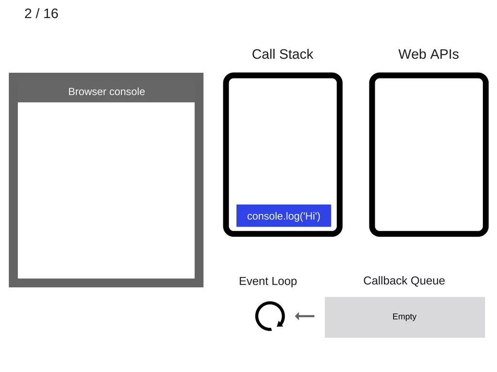
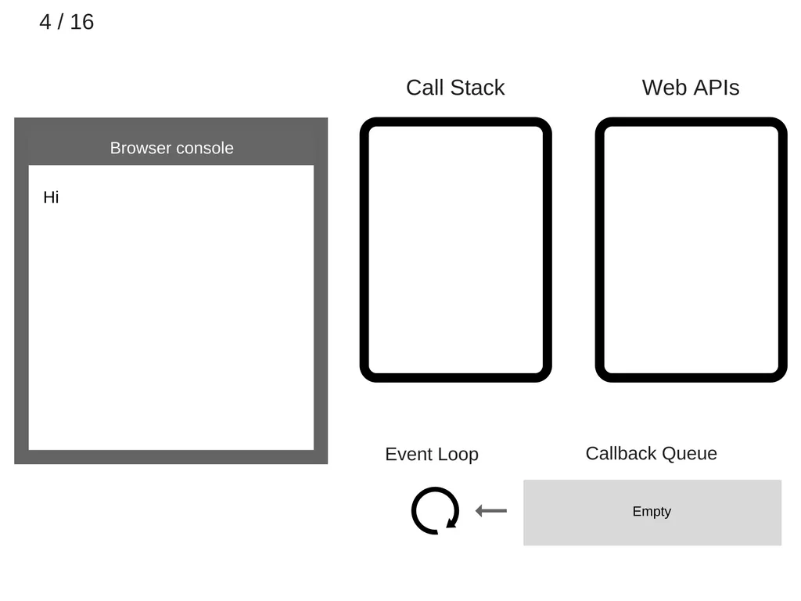
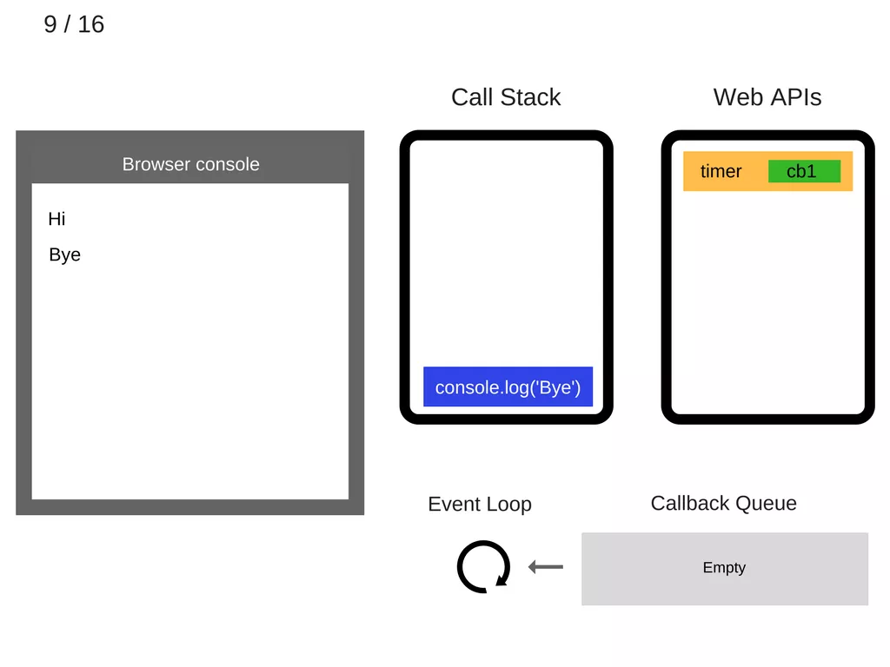
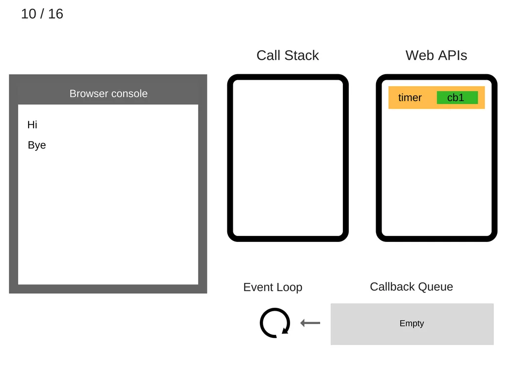
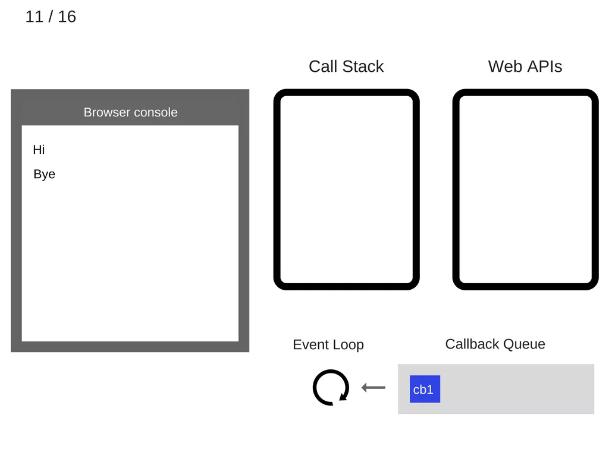
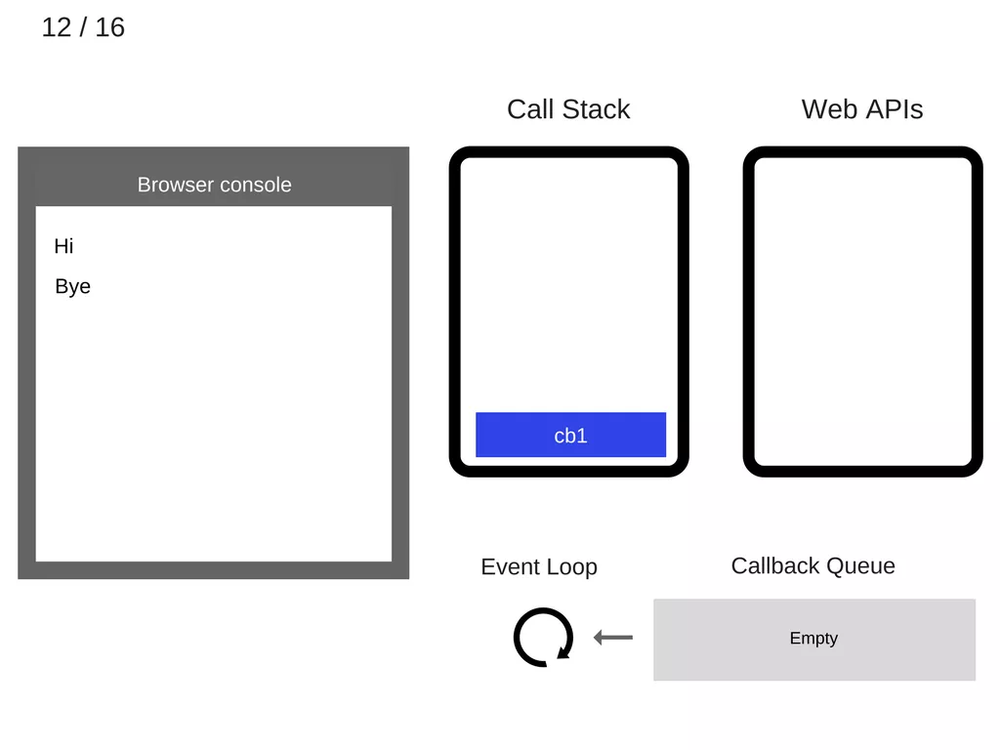
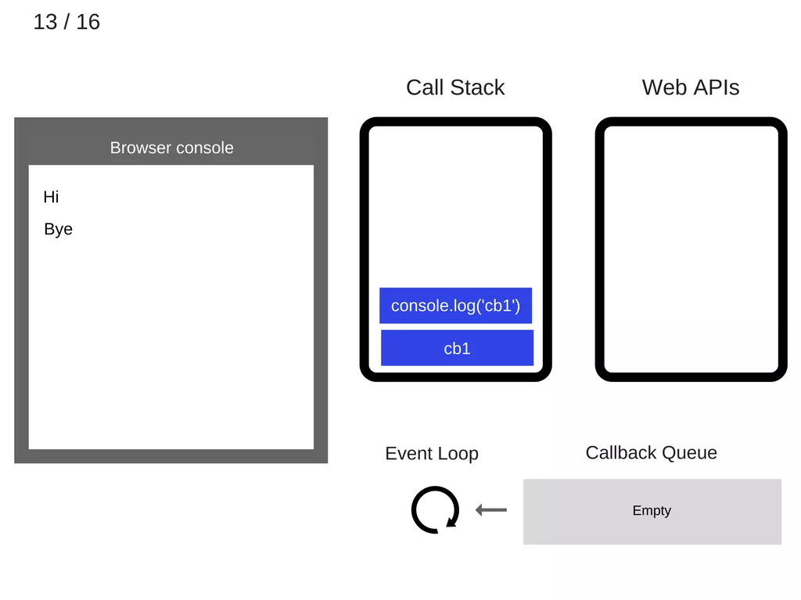
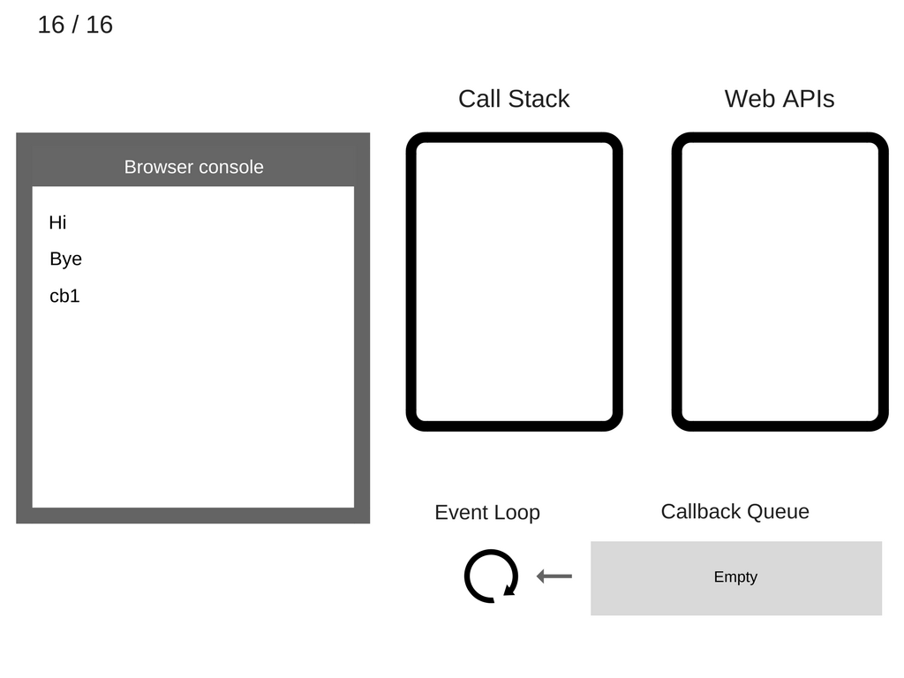
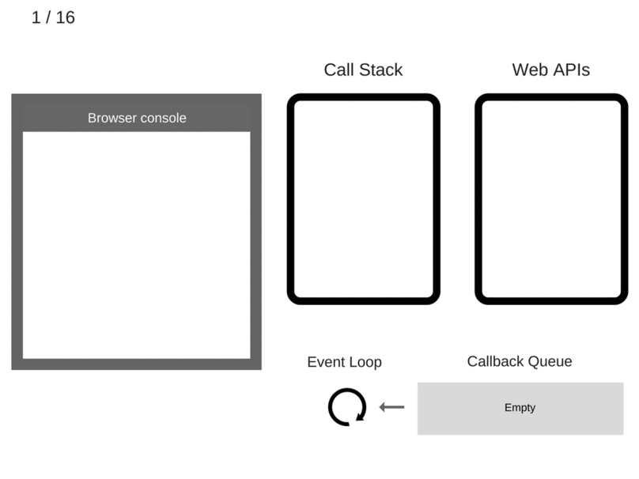

事件循环中的这样一次遍历被称为一个 tick。每个事件就只是一个回调函数。

```
console.log('Hi');
setTimeout(function cb1() { 
    console.log('cb1');
}, 5000);
console.log('Bye');
```

让我们执行这段代码，然后看看会发生什么：

1.空状态。浏览器控制台是空的，调用栈也是空的。


2.console.log('Hi') 入栈。



3.执行 console.log('Hi')。


4.console.log('Hi') 出栈



5、setTimeout(function cb1() { ... }) 入栈。


6.执行 setTimeout(function cb1() { ... })，浏览器创建定时器作为网页 API 的一部分并将会为你处理倒计时。


7.setTimeout(function cb1() { ... }) 执行完毕并出栈。


8.console.log('Bye') 入栈。


9.执行 console.log('Bye')。



10.console.log('Bye') 出栈。



11.至少 5 秒之后，定时器结束运行并把 cb1 回调添加到回调队列。为什么说至少五秒呢？

因为 setTimeout 设定的 timer 并不一定会真的在 5 秒后执行，期间需要考虑是否有其它任务在执行，比方说有 microTask 在执行，如 promise 等，根据官方 event loop 文档即可知。



12.事件循环从回调队列中获得 cb1 函数并且将其入栈。



13.运行 cb1 函数并将 console.log('cb1') 入栈。



14.执行 console.log('cb1')。


15.console.log('cb1') 出栈。


16.cb1 出栈



录像快速回放：



