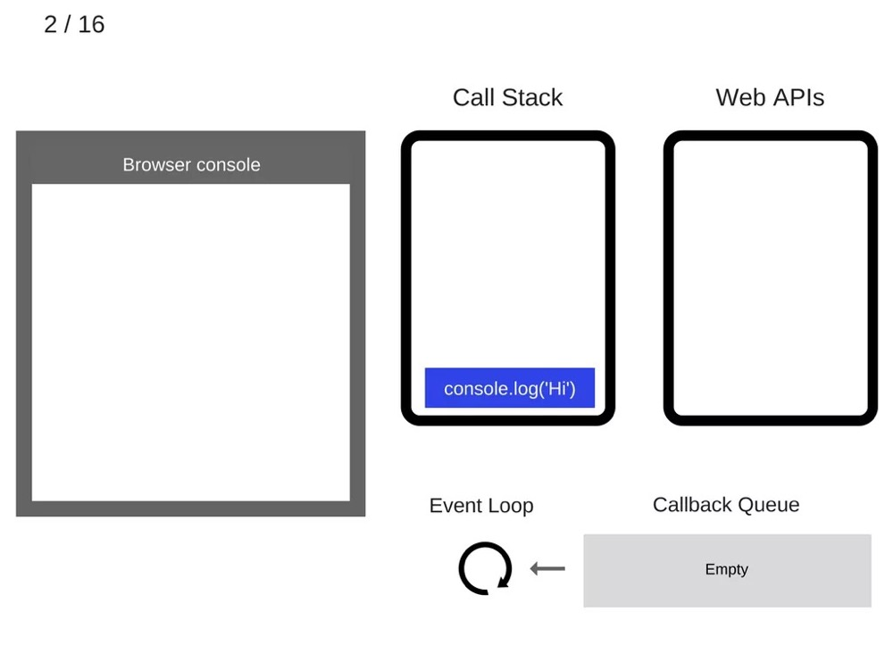
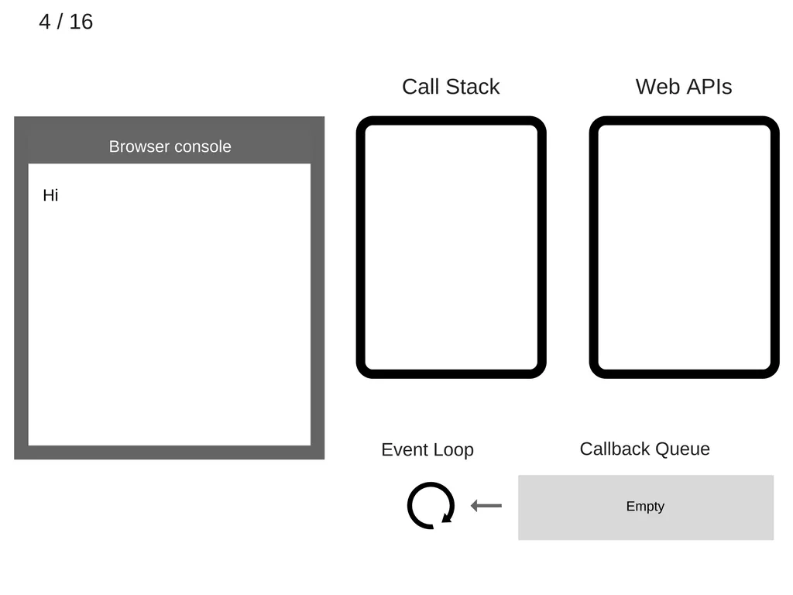
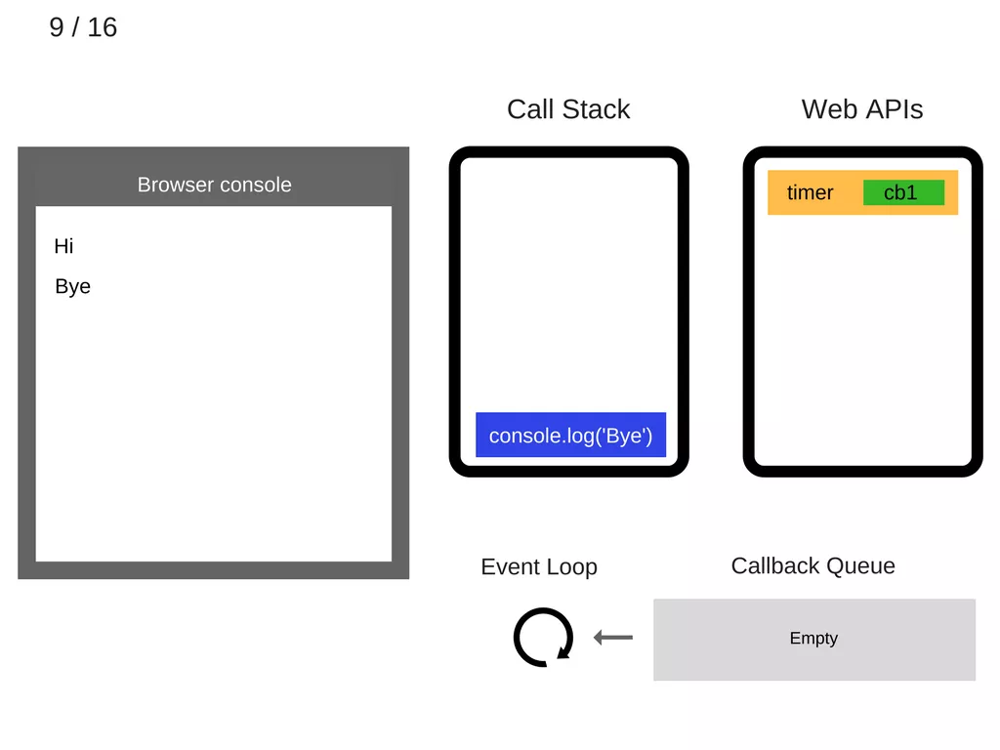
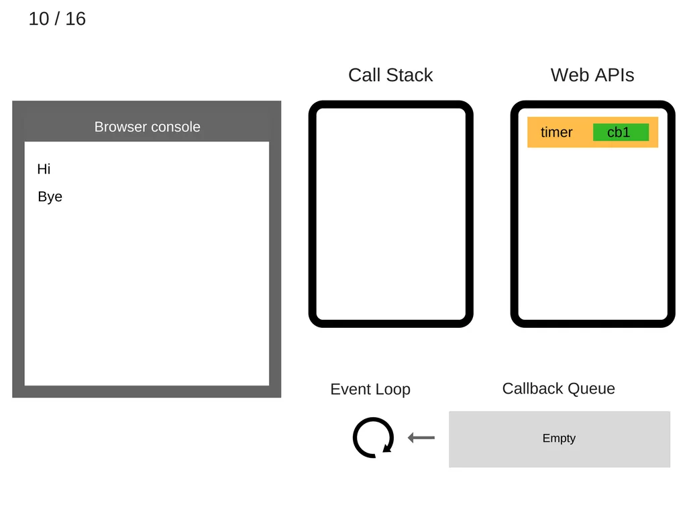
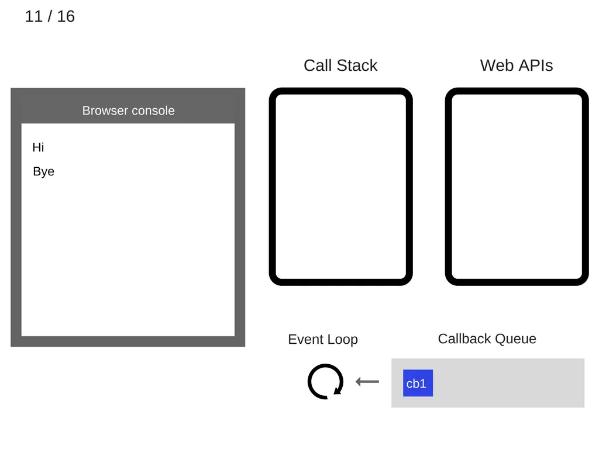
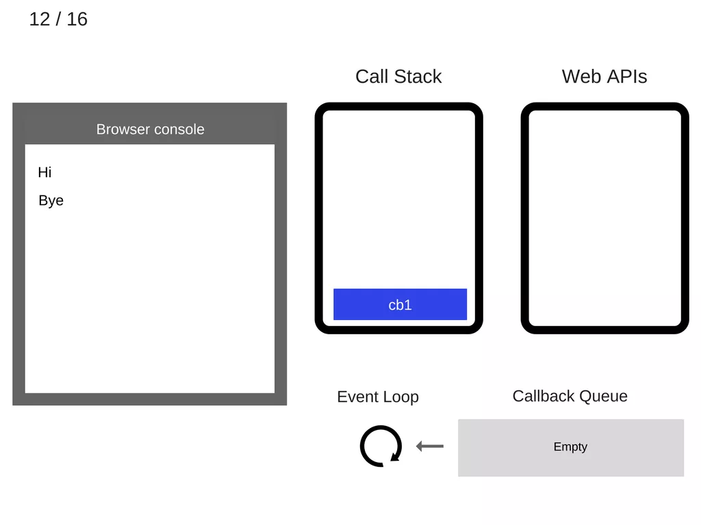
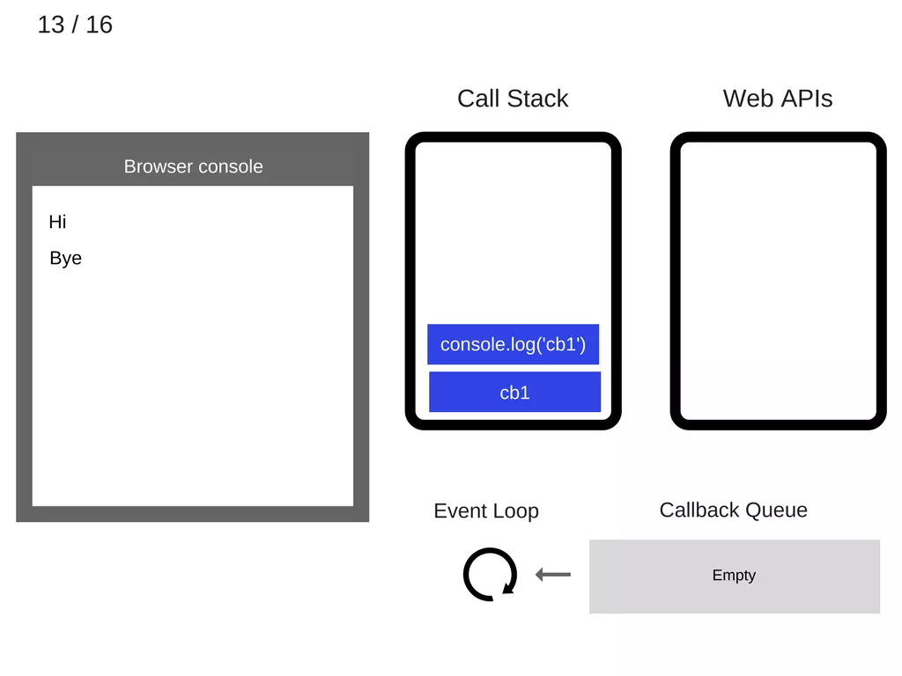

事件循环中的这样一次遍历被称为一个 tick。每个事件就只是一个回调函数。

```
console.log('Hi');
setTimeout(function cb1() { 
    console.log('cb1');
}, 5000);
console.log('Bye');
```

让我们执行这段代码，然后看看会发生什么：

1.空状态。浏览器控制台是空的，调用栈也是空的。


2.console.log('Hi') 入栈。



3.执行 console.log('Hi')。


4.console.log('Hi') 出栈



5、setTimeout(function cb1() { ... }) 入栈。


6.执行 setTimeout(function cb1() { ... })，浏览器创建定时器作为网页 API 的一部分并将会为你处理倒计时。


7.setTimeout(function cb1() { ... }) 执行完毕并出栈。


8.console.log('Bye') 入栈。


9.执行 console.log('Bye')。



10.console.log('Bye') 出栈。



11.至少 5 秒之后，定时器结束运行并把 cb1 回调添加到回调队列。为什么说至少五秒呢？

因为 setTimeout 设定的 timer 并不一定会真的在 5 秒后执行，期间需要考虑是否有其它任务在执行，比方说有 microTask 在执行，如 promise 等，根据官方 event loop 文档即可知。



12.事件循环从回调队列中获得 cb1 函数并且将其入栈。



13.运行 cb1 函数并将 console.log('cb1') 入栈。



14.执行 console.log('cb1')。


15.console.log('cb1') 出栈。


16.cb1 出栈


录像快速回放：


令人感兴趣的是，ES6 规定事件循环如何工作的，这意味着从技术上讲，它在 JS 引擎负责的范围之内，而不再只是扮演着宿主环境的角色。ES6 中 Promise 的出现是导致改变的主要原因之一，因为 ES6 要求有权直接细粒度地调度操作事件循环队列(之后会深入探讨)。

#### setTimeout(…) 工作原理

需要注意的是 setTimeout(…) 并没有自动把回调添加到事件循环队列。它创建了一个定时器。当定时器过期，宿主环境会把回调函数添加到事件循环队列中，然后，将会在未来的某个 tick 取出并执行该回调。查看如下代码：

```
setTimeout(myCallback, 1000);
```

这并不意味着 1 秒之后会执行 myCallback 回调而是在 1 秒后将其添加到回调队列。然而，该队列有可能在之前就添加了其它的事件－所以回调就会被阻塞。

有相当一部分的文章和教程开始会建议你使用 setTimeout(callback, 0) 来书写 JavaScript 异步代码。那么，现在你明白了事件循环和 setTimeout 的原理：调用 setTimeout 把其第二个参数设置为 0 表示延迟执行回调直到调用栈被清空。

查看如下代码：

```
console.log('Hi');
setTimeout(function() {
    console.log('callback');
}, 0);
console.log('Bye');
```

虽然定时时间设定为 0 毫秒， 但是控制台中的结果将会如下显示：

```
Hi
Bye
callback
```

#### ES6 作业概念
