### 浏览器引擎包括两个主要组件：

- 内存堆 － 进行内存分配的区域
- 调用栈－代码执行时栈帧的位置

#### 运行时

几乎每个 JavaScript 开发者都使用过一些[浏览器](http://mp.weixin.qq.com/s?__biz=MjM5MTA1MjAxMQ==&mid=203347979&idx=1&sn=1ce6279e9a5f07abab301fcf7598a7af&scene=21&subscene=126#wechat_redirect) API(比如 setTimeout)。然而这些 API并不是引擎所提供的。

那么它们从何而来？

原来实际情况有点复杂。。

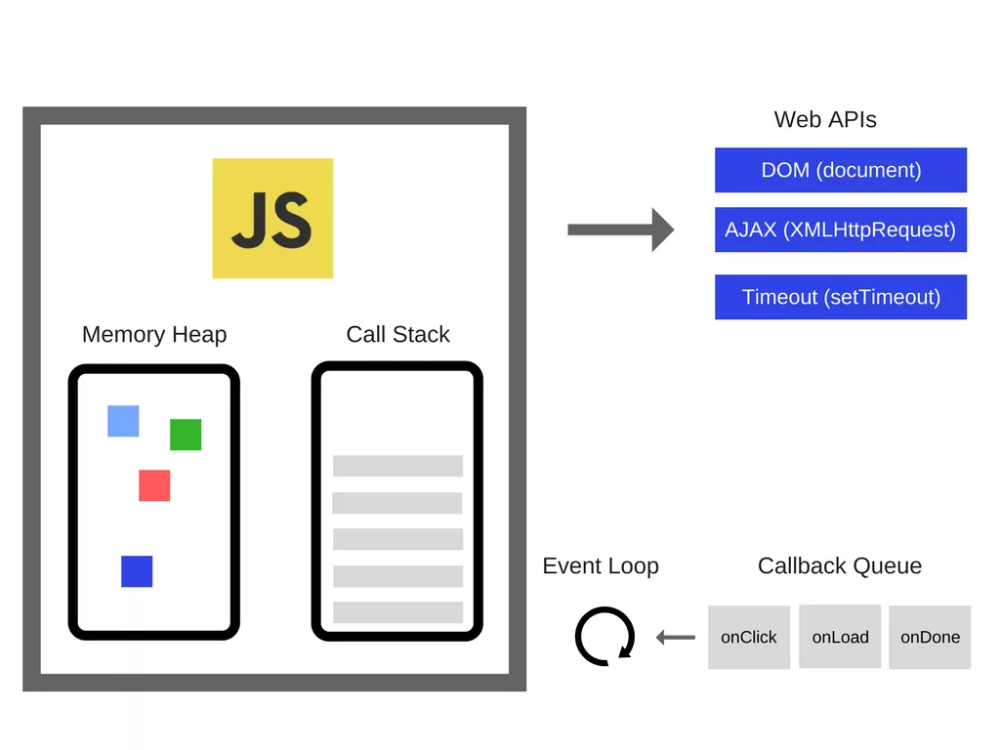

所以，除了引擎之外，实际上还有更多的东西。有被称为 Web API 的东西，这些 Web API 是由浏览器提供的，比如 DOM,AJAX,setTimeout 及其它。

于是乎，就有了如此流行的事件循环和回调队列。

#### 调用栈

JavaScript 只是一个单线程的编程语言，这意味着它只有一个调用栈。这样它只能一次做一件事情。

调用栈是一种数据结构，里面会记录我们在程序中的大概位置。当执行进入一个函数，把它置于栈的顶部。如果从函数中返回则从栈顶部移除函数。这就是调用栈所能够做的事情。

举个栗子。查看如下代码：

```
function multiply(x, y) {  return x * y;}
function printSquare(x) {  var s = multiply(x, x);  console.log(s);}
printSquare(5);
```

当引擎开始执行这段代码的时候，调用栈会被清空。之后，产生如下步骤：

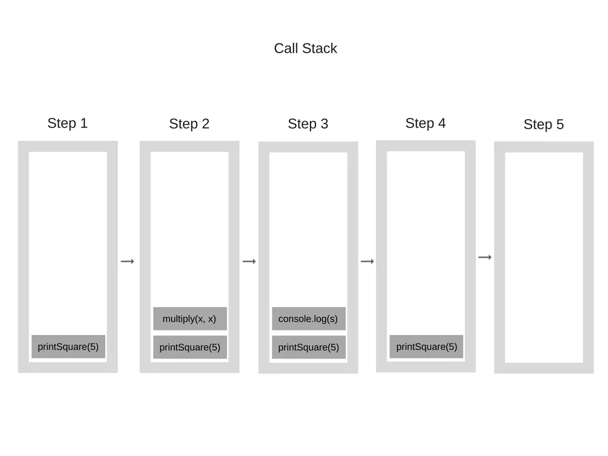

调用栈中的每个条目被称为栈帧。

当抛出异常的时候正好是栈追踪是如何被构造出来的－当发生异常的时候这大致是调用栈的状态。看下如下代码：

```
function foo() {  throw new Error('SessionStack will help you resolve crashes:)');}
function bar() {  foo();}
function start() {  bar();}
start();
```

如果在 Chrome 中执行（假设代码在 foo.js 的文件中），将会产生如下的堆栈追踪：

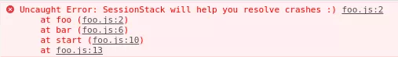

"堆栈溢出"－当达到最大调用栈大小的时候发生。这种情况相当容易发生，特别是当你使用递归而没有进行广泛地测试的时候。查看下如下代码：

```
function foo() {  foo();}
foo();
```

当引擎开始执行这段代码的时候，它开始调用 foo 函数。这个函数，然而，会递归并开始调用其自身而没有任何结束条件。所以在每步执行过程中，调用堆栈会反复地添加同样的函数。执行过程如下所示：

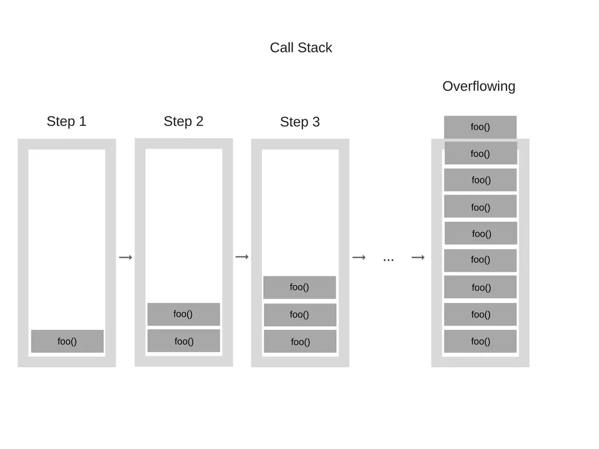

在某一时刻，然而，调用栈中的函数调用次数超过了调用栈的实际大小，这样浏览器决定抛出一个错误，如下所示：

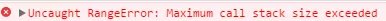

在单线程中运行代码会相当轻松因为你不用处理多线程环境中产生的一些复杂场景，比如死锁。

但是在单线程运行代码也会有相当的限制。由于 JavaScript 只有一个调用栈，如果运行很慢会发生什么？

#### 并发和事件循环

当你在调用栈中有函数为了完成运行需要消耗大量的时间的时候会发生什么？例如，想象一下你想要在浏览器用 JavaScript 来执行一些复杂的图像转化。

你或许会问－为什么这也是个问题？问题是这样的当调用栈有函数需要执行，浏览器实际上不能做其它任何事－它被阻塞了。这意味着浏览器不能够执行渲染，它不能够运行其它代码，它卡住了。如果你想要在 app 中拥有酷炫的流畅 UI 体验，这将会是个问题。

这不会是唯一的问题。一旦浏览器开始在调用栈中执行如此多的任务，浏览器将会在相当一段时间内停止交互。大多数浏览器会抛出一个错误，询问你是否关闭网页。

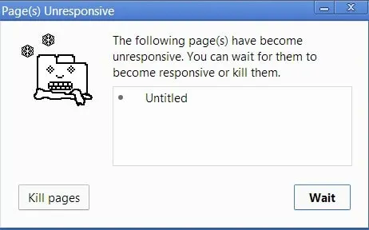

因此，我们如何在不阻塞 UI 且不让浏览器停止响应的情况下执行耗时的代码呢？使用异步回调。


### 事件循环

事件循环中的这样一次遍历被称为一个 tick。每个事件就只是一个回调函数。

```
console.log('Hi');
setTimeout(function cb1() { 
    console.log('cb1');
}, 5000);
console.log('Bye');
```

让我们执行这段代码，然后看看会发生什么：

1.空状态。浏览器控制台是空的，调用栈也是空的。


2.console.log('Hi') 入栈。

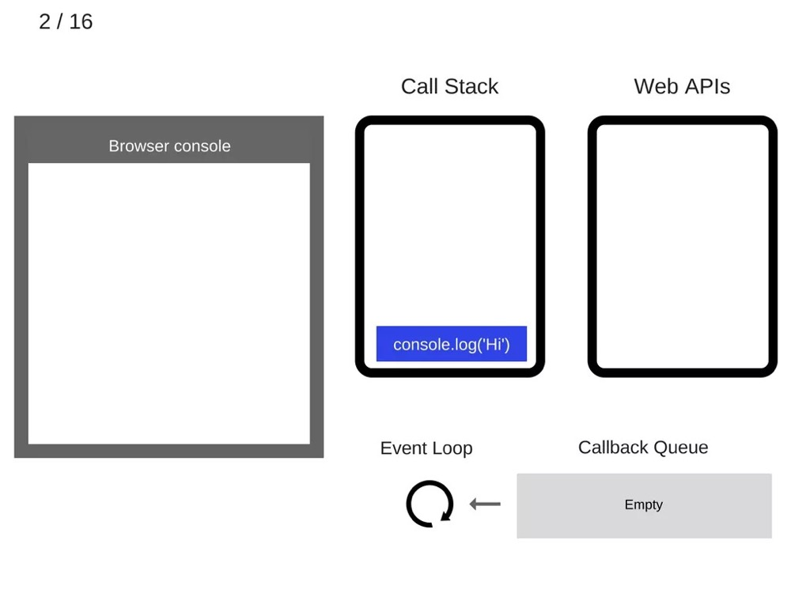

3.执行 console.log('Hi')。

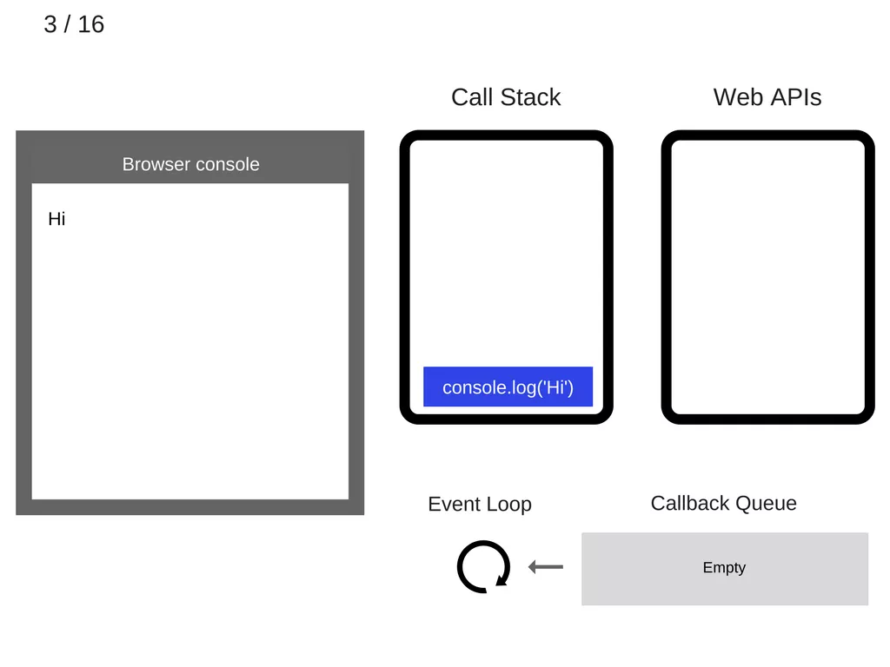

4.console.log('Hi') 出栈

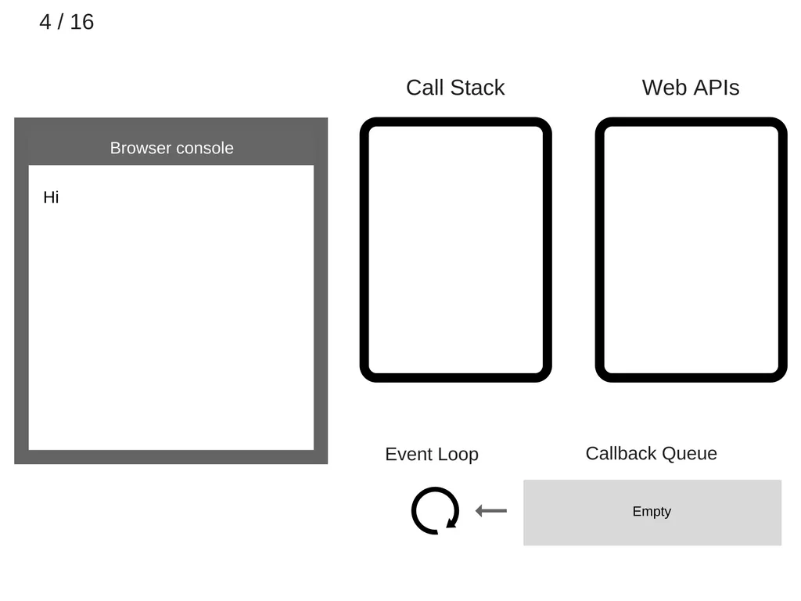

5、setTimeout(function cb1() { ... }) 入栈。


6.执行 setTimeout(function cb1() { ... })，浏览器创建定时器作为网页 API 的一部分并将会为你处理倒计时。


7.setTimeout(function cb1() { ... }) 执行完毕并出栈。


8.console.log('Bye') 入栈。


9.执行 console.log('Bye')。

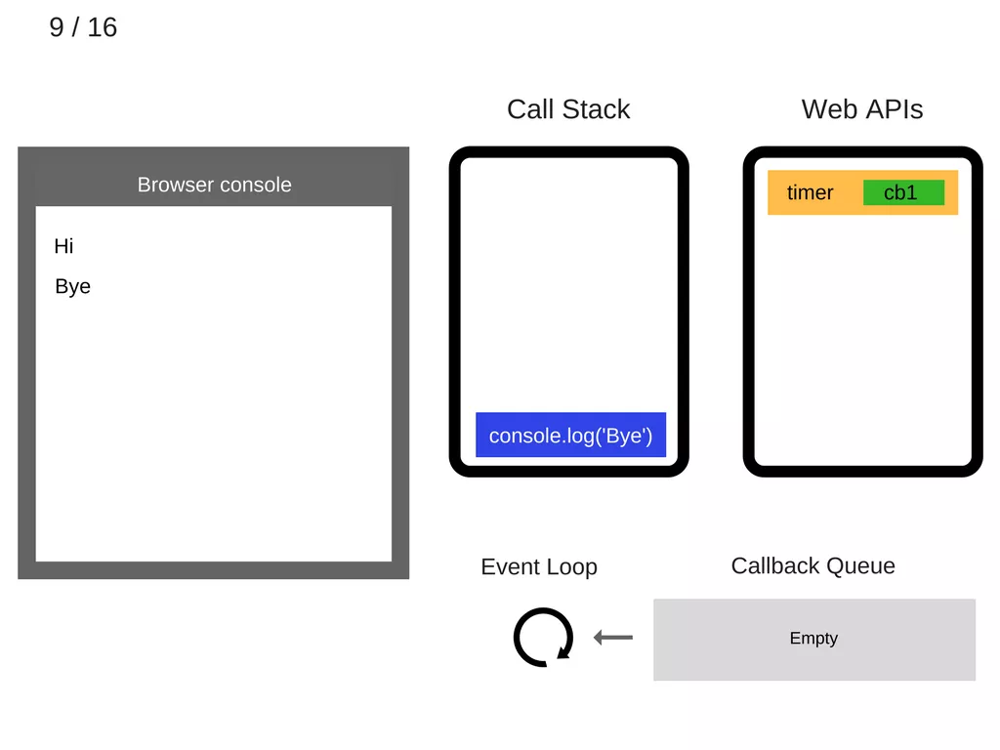

10.console.log('Bye') 出栈。

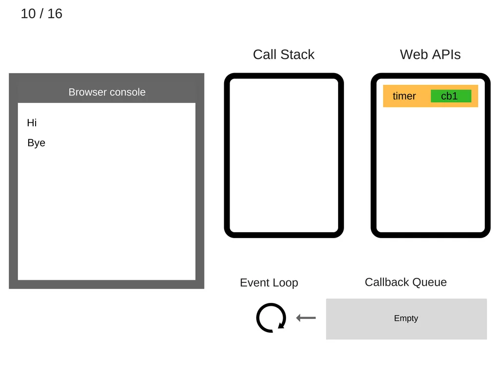

11.至少 5 秒之后，定时器结束运行并把 cb1 回调添加到回调队列。为什么说至少五秒呢？

因为 setTimeout 设定的 timer 并不一定会真的在 5 秒后执行，期间需要考虑是否有其它任务在执行，比方说有 microTask 在执行，如 promise 等，根据官方 event loop 文档即可知。

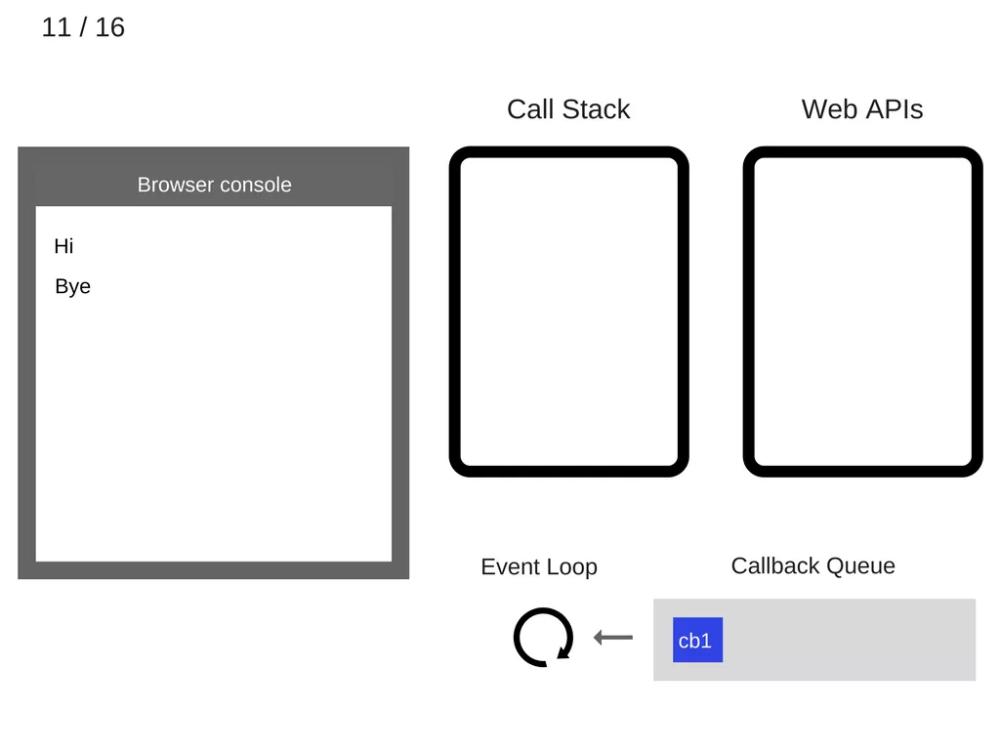

12.事件循环从回调队列中获得 cb1 函数并且将其入栈。

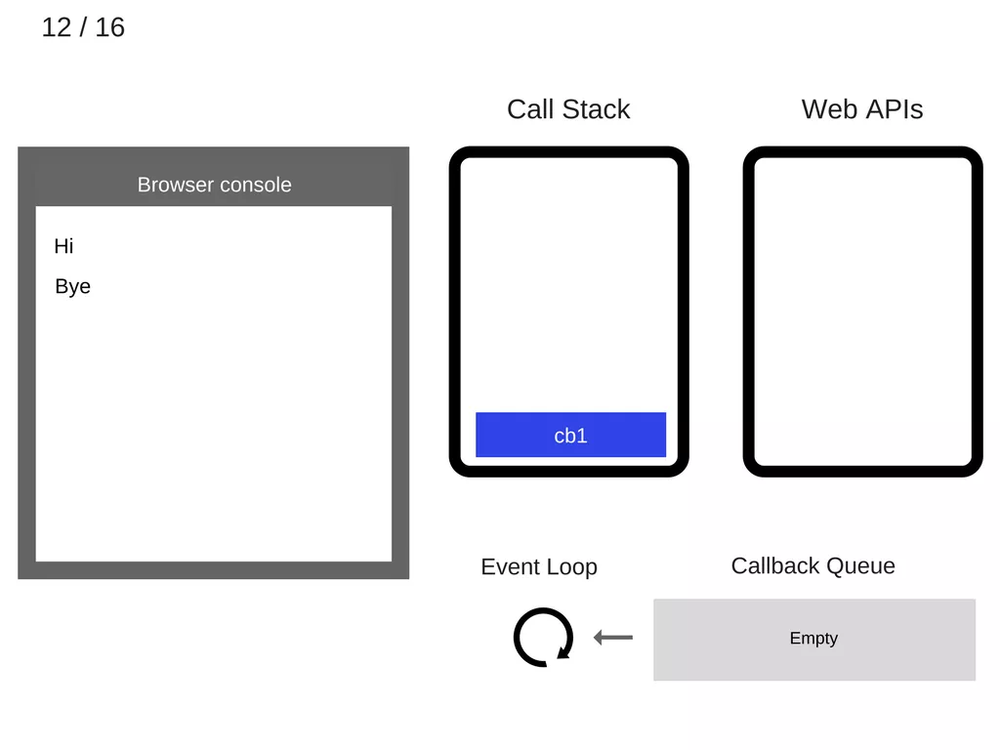

13.运行 cb1 函数并将 console.log('cb1') 入栈。

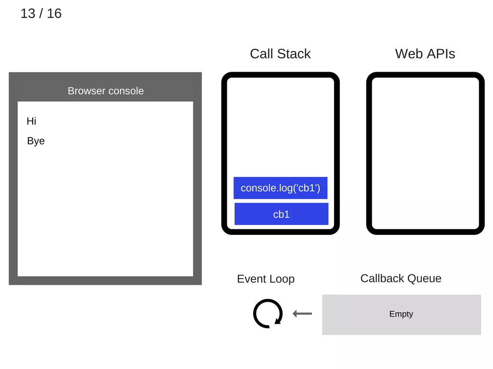

14.执行 console.log('cb1')。


15.console.log('cb1') 出栈。


16.cb1 出栈

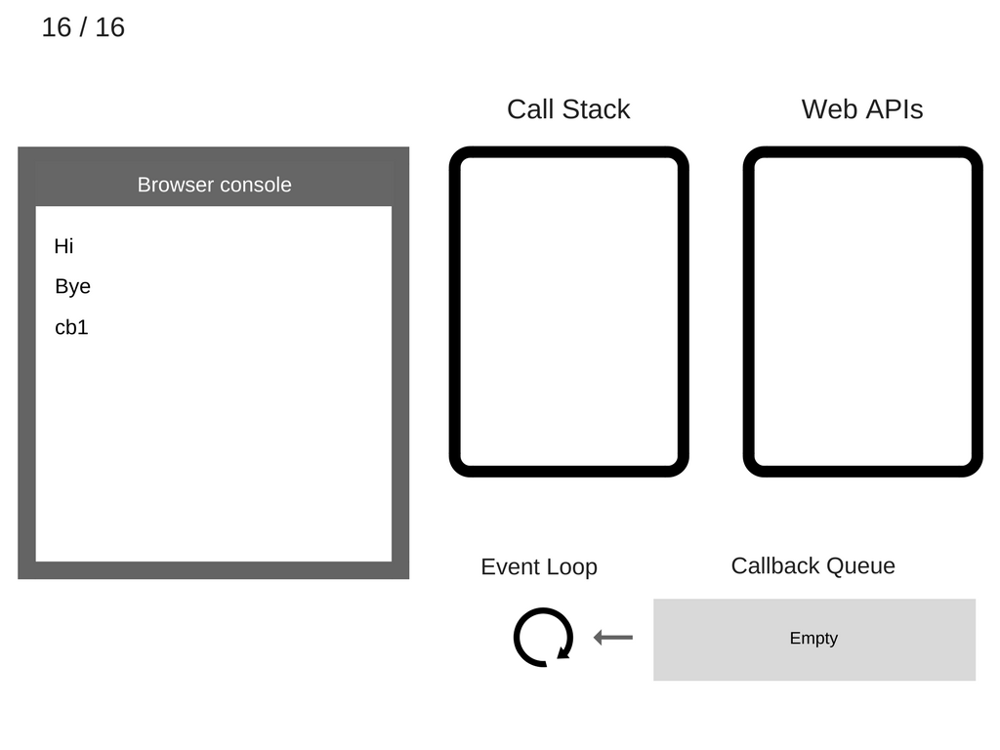

录像快速回放：


#### setTimeout(…) 工作原理

需要注意的是 setTimeout(…) 并没有自动把回调添加到事件循环队列。它创建了一个定时器。当定时器过期，宿主环境会把回调函数添加到事件循环队列中，然后，将会在未来的某个 tick 取出并执行该回调。查看如下代码：

```
setTimeout(myCallback, 1000);
```

这并不意味着 1 秒之后会执行 myCallback 回调而是在 1 秒后将其添加到回调队列。然而，该队列有可能在之前就添加了其它的事件－所以回调就会被阻塞。

有相当一部分的文章和教程开始会建议你使用 setTimeout(callback, 0) 来书写 JavaScript 异步代码。那么，现在你明白了事件循环和 setTimeout 的原理：调用 setTimeout 把其第二个参数设置为 0 表示延迟执行回调直到调用栈被清空。

查看如下代码：

```
console.log('Hi');
setTimeout(function() {
    console.log('callback');
}, 0);
console.log('Bye');
```

虽然定时时间设定为 0 毫秒， 但是控制台中的结果将会如下显示：

```
Hi
Bye
callback
```

#### ES6 作业概念
